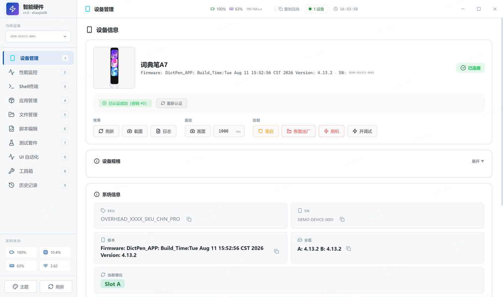
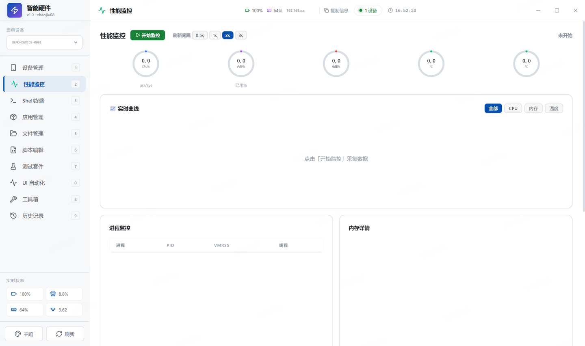
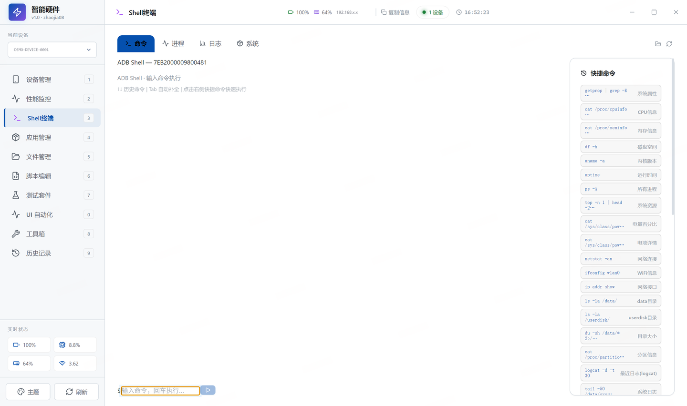
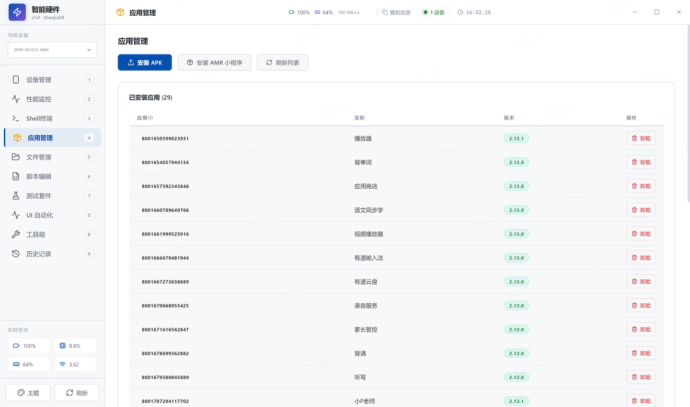
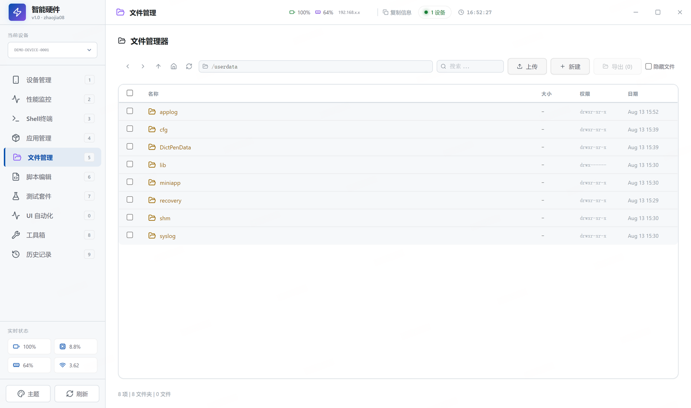
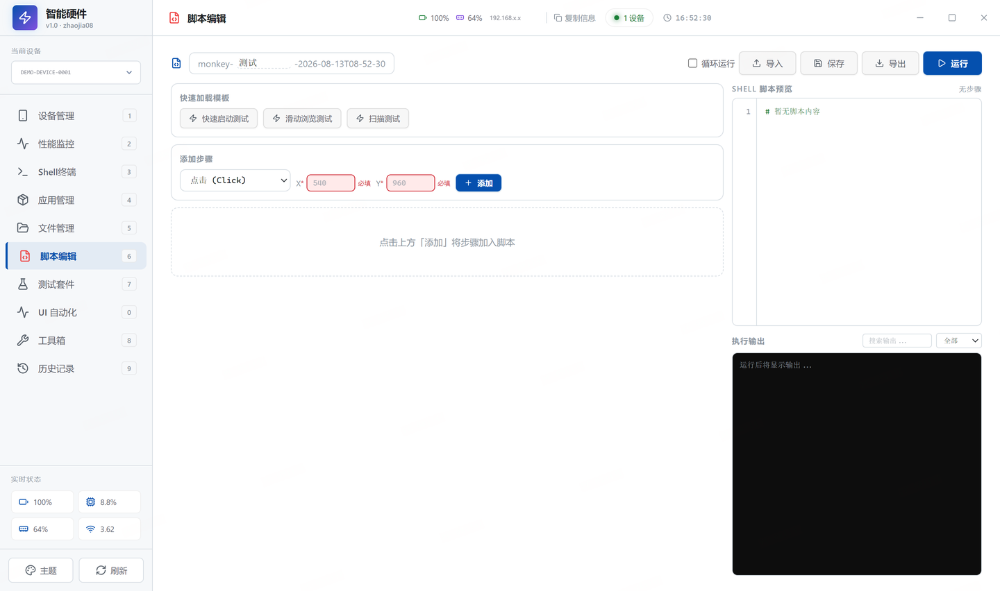
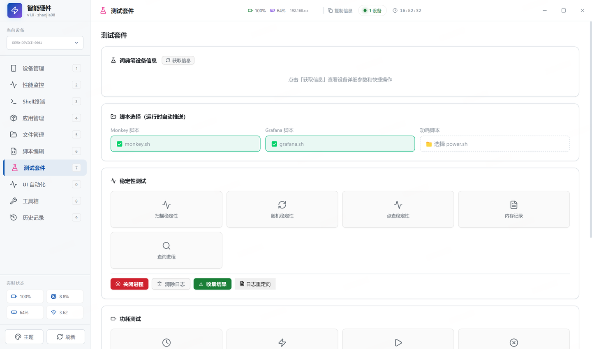
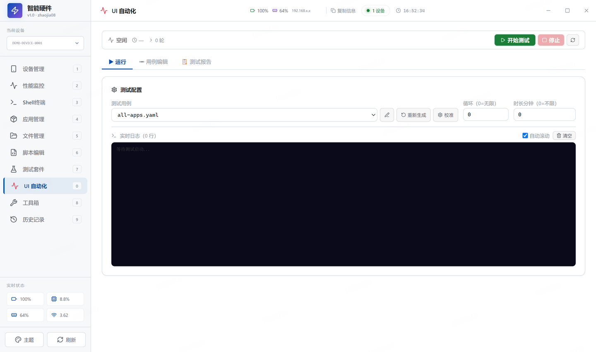
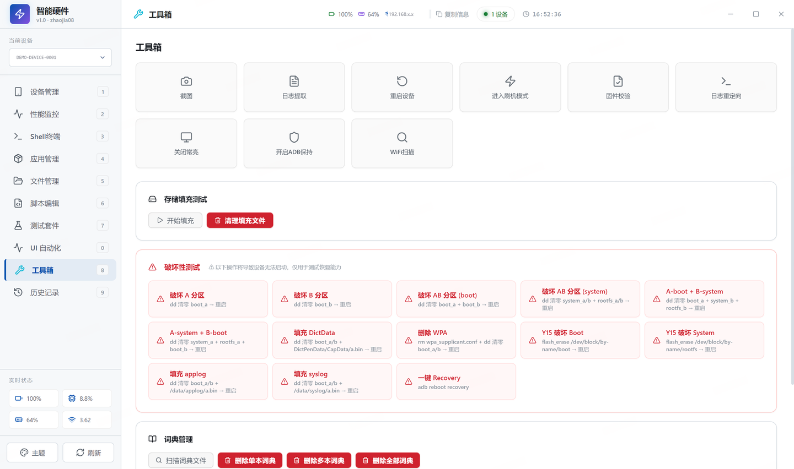

# 智能硬件测试工具 · HardWare Test Tools

> 面向 Android 智能硬件（词典笔等）的一体化 ADB 调试与测试工作台。
> 把散落在命令行里的 adb 操作，收进一个可视化桌面应用。



---

## 目录

- [这是什么](#这是什么)
- [技术栈](#技术栈)
- [功能模块](#功能模块)
- [界面预览](#界面预览)
- [快速开始](#快速开始)
- [快捷键](#快捷键)
- [项目结构](#项目结构)
- [构建打包](#构建打包)
- [常见问题](#常见问题)

---

## 这是什么

日常做硬件测试，绕不开 `adb`：看设备信息、抓性能、装包卸包、推拉文件、跑脚本、截图录屏……
命令记不住，参数拼半天，多设备还容易搞错目标。

这个工具把这些事情做成了图形界面：**插上设备，点就完事**。

- 实时读取设备状态（电量、内存、CPU、Wi-Fi、温度）
- 一键刷新 / 重启 / 恢复出厂 / 刷机 / 开调试
- 性能曲线实时采集，进程与内存明细可视化
- APK 与 AMR 小程序安装、批量卸载
- 内置 Shell 终端、文件浏览器、脚本编辑器
- 测试套件与 UI 自动化编排
- 所有操作留痕，可回溯历史记录

**适用对象**：硬件 QA、固件工程师、以及任何需要频繁和 Android 设备打交道的人。

---

## 技术栈

| 层 | 选型 |
| --- | --- |
| 桌面容器 | Electron 33 |
| 前端框架 | React 19 + TypeScript 5.8 |
| 构建工具 | Vite 7 |
| 图标 | lucide-react |
| 图表 | recharts |
| 时间处理 | dayjs |
| 样式 | 原生 CSS（无 UI 组件库，界面全自绘） |
| 设备通信 | Android Debug Bridge (adb) |

> 说明：界面没有引入 Ant Design 之类的组件库，所有控件与布局均为项目内自行实现，
> 因此体积小、启动快、视觉风格完全可控。

当前版本：**v3.3.3**　打包产物：`HardWare_TestTools`（Windows portable，免安装）

---

## 功能模块

侧边栏共 10 个模块，按使用频率排序：

### 1. 设备管理 `Ctrl+1`
设备发现与连接、设备信息总览（型号 / 固件 / 版本 / SN / SKU / 分区 / 当前槽位）、
设备规格展开查看、密钥认证状态，以及常用控制动作：
刷新、截图、日志、画面推流、重启、恢复出厂、刷机、开调试。

### 2. 性能监控 `Ctrl+2`
CPU、内存、电量、温度实时仪表盘，采样间隔可选 0.5s / 1s / 2s / 3s。
实时曲线支持按指标筛选（全部 / CPU / 内存 / 温度），下方联动展示进程监控（PID、VMRSS、线程数）与内存详情。

### 3. Shell 终端 `Ctrl+3`
内置 adb shell 交互终端，支持命令历史与常用命令快捷插入，无需切换到外部命令行。

### 4. 应用管理 `Ctrl+4`
已安装应用列表（应用 ID / 名称 / 版本），支持安装 APK、安装 AMR 小程序、单个卸载与列表刷新。

### 5. 文件管理 `Ctrl+5`
设备文件系统浏览，支持上传（push）、下载（pull）、新建目录、删除与重命名。

### 6. 脚本编辑 `Ctrl+6`
可视化脚本编辑与执行：编写 adb / shell 脚本并保存，一键对当前设备运行，输出实时回显。

### 7. 测试套件 `Ctrl+7`
稳定性测试与功耗测试：把多个检查项组织成可复用的测试集，批量执行并汇总通过 / 失败结果。

### 8. UI 自动化 `Ctrl+8`
UI 自动化测试，点击即运行——用例编排完成后可直接回放，无需额外脚本环境。

### 9. 工具箱 `Ctrl+9`
截图、WiFi、固件等零散但高频的实用工具集合。

### 10. 历史记录
所有执行过的命令与操作记录，可检索、可复用。

---

## 界面预览

> 截图中的设备序列号、SKU 与内网 IP 均已脱敏处理。

### 性能监控
实时曲线 + 进程 / 内存明细


### Shell 终端


### 应用管理


### 文件管理


### 脚本编辑


### 测试套件


### UI 自动化


### 工具箱


---

## 快速开始

### 环境要求

- Node.js ≥ 18
- Windows 10 / 11（当前打包目标平台）
- adb 可执行文件（项目内置，或自行配置到 PATH）
- 设备已开启「USB 调试」

### 开发模式

```bash
git clone https://github.com/Jia-zhao-git/HardWare.git
cd HardWare
npm install
npm run dev
```

### 生产构建

```bash
npm run build      # tsc 类型检查 + vite 构建
npm run pack       # 构建 + 打包为免安装目录（--dir）
npm run dist       # 构建 + 打包为 Windows portable exe
npm run clean      # 清理 release 目录
```

产物输出在 `release/` 目录，双击即可运行，无需安装。

### 连接设备

1. 用 USB 连接设备，或确保设备与电脑在同一局域网
2. 启动应用，左上角「当前设备」下拉框会自动列出已识别设备
3. 选中设备后，底部「实时状态」开始刷新，即可开始操作

---

## 快捷键

| 快捷键 | 跳转模块 |
| --- | --- |
| `Ctrl+1` | 设备管理 |
| `Ctrl+2` | 性能监控 |
| `Ctrl+3` | Shell 终端 |
| `Ctrl+4` | 应用管理 |
| `Ctrl+5` | 文件管理 |
| `Ctrl+6` | 脚本编辑 |
| `Ctrl+7` | 测试套件 |
| `Ctrl+8` | UI 自动化 |
| `Ctrl+9` | 工具箱 |
| `Ctrl+R` | 刷新设备列表 |
| `Ctrl+T` | 切换主题面板 |
| `Esc` | 关闭主题面板 |

> 「历史记录」未绑定快捷键，点击侧栏进入。
>
> ⚠️ 已知小问题：侧栏徽标数字直接取自配置里的 `shortcut` 字段，而实际快捷键按导航顺序索引生成，
> 因此「UI 自动化」徽标显示 `0`、「工具箱」显示 `8`、「历史记录」显示 `9`，与真实按键不一致。
> 请以上表为准。

---

## 项目结构

```
ADB-TOOLS-V1.0/
├─ electron/            # Electron 主进程与 preload
├─ src/
│  ├─ App.tsx           # 应用外壳：侧边栏导航 + 快捷键 + 全局状态
│  ├─ pages/            # 各功能模块页面
│  │  ├─ DevicePage.tsx
│  │  ├─ PerfPage.tsx
│  │  ├─ ShellPage.tsx
│  │  ├─ AppPage.tsx
│  │  ├─ FileManagerPage.tsx
│  │  ├─ ScriptEditorPage.tsx
│  │  ├─ TestPage.tsx
│  │  ├─ UiTestPage.tsx
│  │  ├─ ToolsPage.tsx
│  │  ├─ HistoryPage.tsx
│  │  ├─ LogPage.tsx
│  │  └─ NovelReaderPage.tsx
│  ├─ components/       # 复用组件
│  ├─ hooks/            # 自定义 hooks
│  └─ styles/           # 样式
├─ docs/images/         # README 截图
├─ build/               # 图标等打包资源
└─ package.json
```

---

## 常见问题

**Q：设备列表为空？**
确认设备已开启 USB 调试，并在设备端弹窗中允许本机调试。可在 Shell 终端执行 `adb devices` 自检。

**Q：性能曲线不动？**
性能监控需要手动点击「开始监控」后才开始采集。

**Q：恢复出厂 / 刷机会清数据吗？**
会。这两个操作不可逆，执行前请确认目标设备无误——多设备场景下务必先核对左上角「当前设备」。

**Q：为什么截图里的序列号是 `DEMO-DEVICE-0001`？**
文档截图统一做了脱敏，真实设备信息不会出现在公开仓库中。

---

## 作者

**zhaojia08** — 硬件测试工具链

---

## License

内部工具，暂未开源授权。
